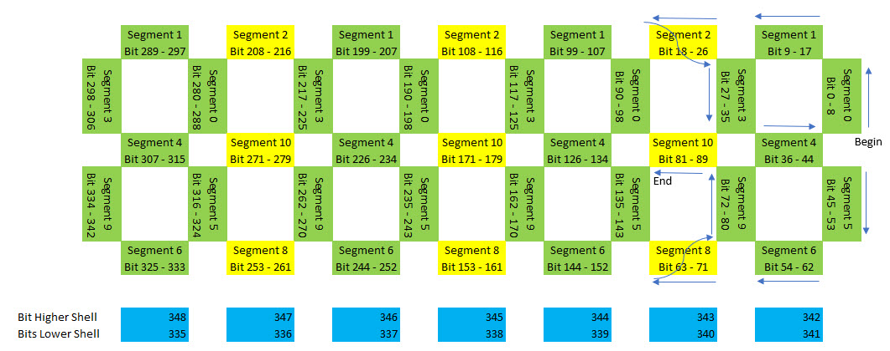

############################################
# Giant LED Clock with ESP (Arduino) 

a 3d Printed Giant LED with an ESP (Arduino).

FEATURES:
- OTA-Update
- It has shelves that can colored with leds
- and the biggest features is IT SHOW YOU THE TIME!

PLANNED:
- MQTT for Notifications from the house automation
- temperature-dependent color transmit over MQTT from the home automation

############################################

List of items i used in this project:

- An Wemos D1 mini

- A 5m roll of WS2812B LEDS with 60 LED’s a meter

- A 5v power supply with screw terminals

- Many sorts of cable ;-)

############################################
# The Wiring

############################################

3D printed parts and wiring diagram can be downloaded from here: https://www.thingiverse.com/thing:4207524

############################################

Buy me a coffee to say thanks: https://ko-fi.com/etnie

SUBSCRIBE: 
- https://www.youtube.com/etnie383
- https://www.thingiverse.com/etnie

INSTAGRAM: https://www.instagram.com/andre_geig
